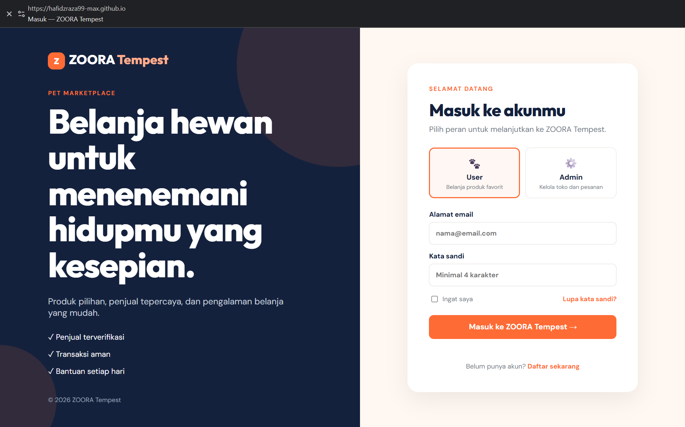
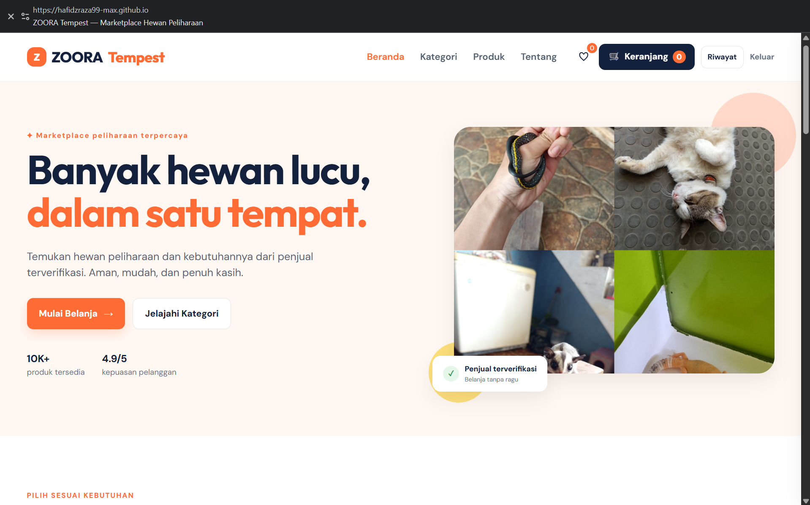
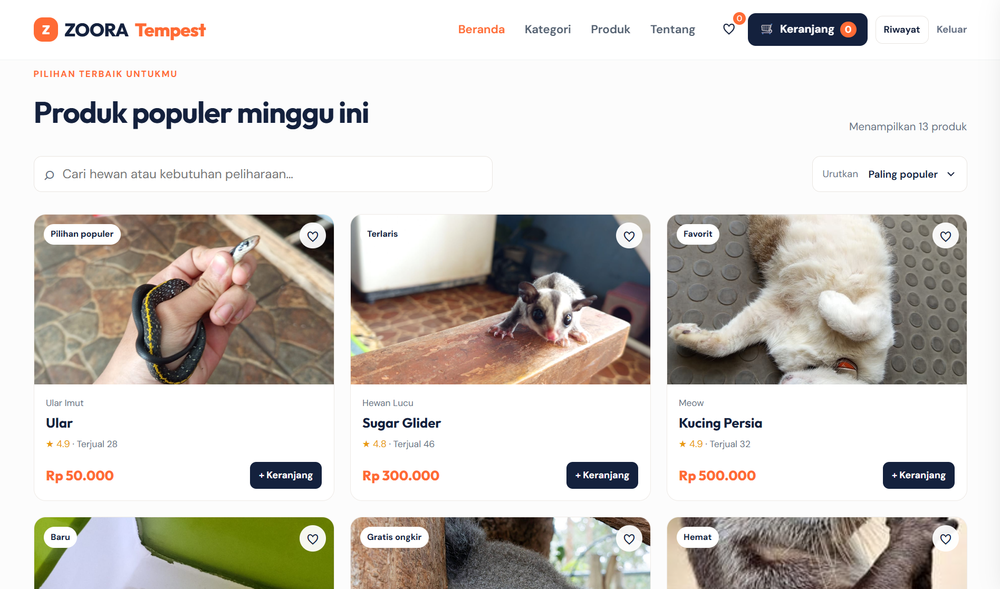
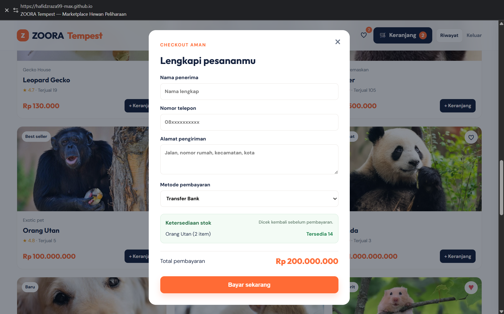
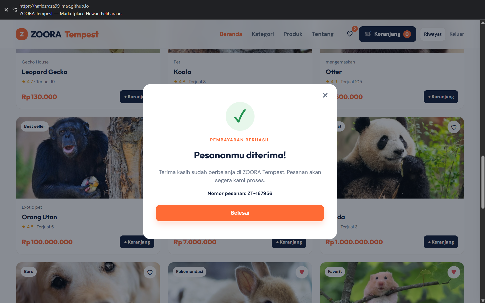
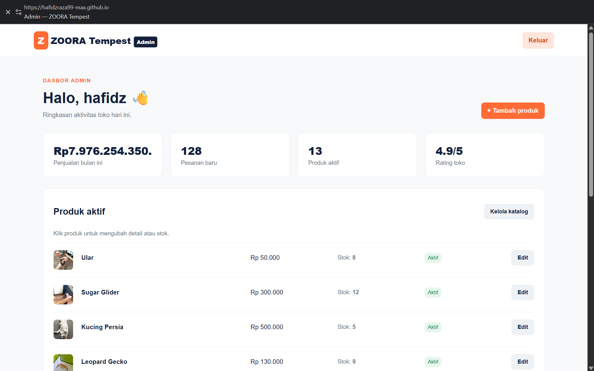
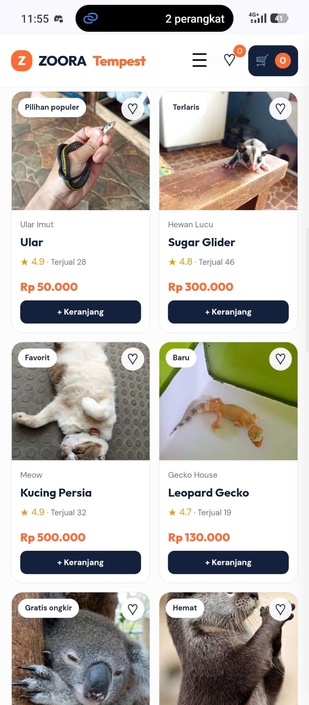
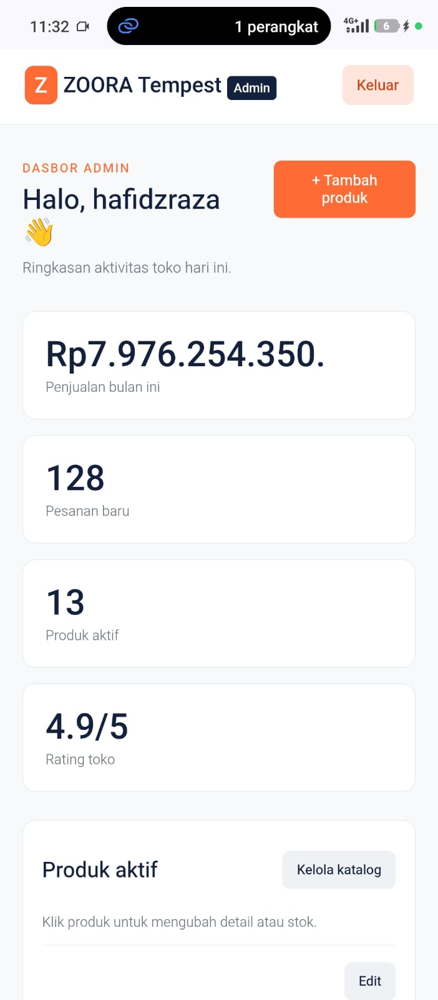

# ZOORA Tempest

> Prototype marketplace hewan peliharaan yang responsif, interaktif, dan berorientasi pada pengalaman belanja yang aman.

## Informasi Proyek

| Item | Keterangan |
| --- | --- |
| Nama bisnis | ZOORA Tempest |
| Model bisnis | B2C marketplace kebutuhan dan hewan peliharaan |
| Teknologi | HTML5, CSS3, JavaScript (Vanilla ES6+), localStorage |
| Repository GitHub | `https://hafidzraza99-max.github.io/ZOORA-Tempest/` |
| GitHub Pages | `https://github.com/hafidzraza99-max/ZOORA-Tempest` |
| Demo lokal | Buka `index.html` |

## Deskripsi & Proposisi Nilai

ZOORA Tempest adalah prototype e-commerce yang membantu pecinta hewan menemukan hewan peliharaan dan kebutuhan pendukungnya dalam satu marketplace. Nilai utama yang ditawarkan adalah katalog yang mudah dijelajahi, penjual terverifikasi, proses checkout yang jelas, serta pengelolaan produk dari sisi admin.

## Fitur Utama

### Pengguna

- Login dengan pilihan peran **User** dan **Admin**.
- Katalog 13 produk dengan pencarian, filter kategori, dan urut harga.
- Simpan produk favorit.
- Keranjang belanja: tambah item, ubah jumlah, hapus item, dan total otomatis.
- Checkout simulasi dengan data penerima, alamat, dan pilihan metode pembayaran.
- Halaman pembayaran berhasil dengan nomor pesanan.
- Riwayat pembayaran tersimpan menggunakan `localStorage`.
- Tampilan responsif untuk desktop, tablet, dan mobile.

### Admin

- Dasbor ringkasan bisnis dan jumlah produk aktif.
- Daftar katalog yang dapat diklik.
- Tambah produk baru, termasuk nama, harga, kategori, stok, dan gambar.
- Edit produk dan stok produk.
- Data katalog admin tersimpan menggunakan `localStorage`.

## Target Pasar & Segmentasi

1. **Pemilik hewan pemula** — membutuhkan informasi dan proses belanja yang sederhana.
2. **Pecinta reptil dan hewan eksotis** — mencari produk yang lebih spesifik dan penjual tepercaya.
3. **Usia 17–40 tahun di kota besar** — aktif menggunakan perangkat mobile serta terbiasa berbelanja online.

## Analisis Pasar & Pesaing

Pasar kebutuhan hewan tumbuh karena meningkatnya jumlah pemilik hewan dan kecenderungan memperlakukan hewan sebagai anggota keluarga. Kompetitor umum meliputi marketplace besar dengan kategori pet supplies dan toko hewan lokal yang menjual melalui media sosial.

Strategi pembeda ZOORA Tempest adalah fokus pada pengalaman belanja khusus hewan: kurasi katalog, informasi penjual terverifikasi, pengelompokan produk yang mudah, dan alur checkout yang sederhana.

## Strategi Produk & Katalog

Katalog menggunakan visual produk, nama yang ringkas, harga, rating, jumlah terjual, serta label seperti *Terlaris* dan *Baru*. Produk mencakup mamalia, reptil, serta perlengkapan pendukung. Admin dapat menambah, memperbarui stok, mengganti detail, dan menambahkan gambar produk.

## Model Bisnis & Pendapatan

| Sumber pendapatan | Penjelasan |
| --- | --- |
| Komisi transaksi | Persentase dari setiap transaksi yang berhasil. |
| Biaya layanan penjual | Paket promosi atau fitur katalog premium. |
| Produk unggulan | Penjual membayar untuk menampilkan produk di area prioritas. |
| Kolaborasi brand | Promosi produk makanan, aksesori, dan kebutuhan hewan. |

## Strategi Harga, Promo, & Diskon

- Harga mengikuti kualitas produk, stok, dan harga pasar.
- Label promo seperti gratis ongkir, produk baru, dan produk terlaris membantu konversi.
- Rencana promosi mencakup voucher pengguna baru, bundling kebutuhan hewan, flash sale, dan gratis ongkir minimum belanja tertentu.

## Checkout & Simulasi Pembayaran

Checkout pada prototype meminta nama penerima, nomor telepon, alamat, dan metode pembayaran: Transfer Bank, E-Wallet, atau Bayar di Tempat. Setelah formulir valid, sistem menampilkan status pembayaran berhasil dan menyimpan riwayat transaksi secara lokal.

Untuk implementasi produksi, simulasi ini dapat diintegrasikan dengan **Midtrans** atau **Xendit**. Server backend wajib membuat token transaksi dan memverifikasi status pembayaran melalui webhook agar pembayaran tidak hanya bergantung pada sisi browser.

## SEO, Keamanan, & Pemeliharaan

### SEO

- Gunakan judul halaman dan meta description yang relevan.
- Tambahkan kata kunci natural seperti “marketplace hewan peliharaan”, “reptil”, dan “kebutuhan hewan”.
- Optimalkan `alt` pada gambar produk dan struktur heading yang semantik.
- Buat sitemap, robots.txt, dan halaman produk individual saat aplikasi dikembangkan lebih lanjut.

### Keamanan

- Validasi input form di sisi klien; produksi harus menambahkan validasi sisi server.
- Jangan menyimpan data pembayaran sensitif di `localStorage`.
- Gunakan HTTPS, sanitasi input, autentikasi aman, serta token/CSRF protection pada backend.
- Pembayaran produksi harus melalui payment gateway tepercaya.

### Pemeliharaan

- Perbarui stok dan harga secara berkala.
- Uji tampilan pada desktop, tablet, dan mobile setelah setiap perubahan.
- Pantau error JavaScript dan masukan pengguna untuk perbaikan pengalaman belanja.

## Rencana Analytics

Google Analytics 4 dapat dipasang menggunakan script dummy/Measurement ID saat deployment. Metrik utama yang dipantau:

- **Bounce rate / engagement rate:** mengevaluasi kualitas halaman awal dan katalog.
- **Konversi:** perbandingan pengunjung, produk ditambahkan ke keranjang, checkout, dan pembayaran berhasil.
- **Produk populer:** dasar untuk pengadaan stok dan promosi.
- **Perangkat & ukuran layar:** memastikan prioritas optimasi mobile.
- **Sumber trafik:** mengukur efektivitas SEO, media sosial, dan kampanye promosi.

## Struktur Folder

```text
Raja/
├── index.html              # Halaman login
├── marketplace.html        # Katalog, keranjang, checkout, riwayat pembayaran
├── admin.html              # Dasbor pengelolaan produk
├── css/
│   ├── style.css
│   ├── marketplace.css
│   ├── mobile-fix.css
│   ├── login.css
│   ├── admin.css
│   ├── admin-extra.css
│   └── admin-mobile-fix.css
├── js/
│   ├── login.js
│   ├── app.js
│   └── admin.js
├── images/                 # Aset produk
└── screenshots/            # Tangkapan layar desktop dan mobile
```

## Cara Menjalankan

1. Unduh atau clone repository ini.
2. Buka folder proyek.
3. Jalankan `index.html` pada browser modern.
4. Pilih peran **User** untuk marketplace atau **Admin** untuk dasbor pengelolaan produk.

## Dokumentasi Tampilan

### Tampilan Desktop

| Login | Beranda marketplace |
| --- | --- |
|  |  |

| Katalog produk | Checkout pembayaran |
| --- | --- |
|  |  |

| Pembayaran berhasil | Dasbor admin |
| --- | --- |
|  |  |

### Tampilan Mobile

| Marketplace mobile | Admin mobile |
| --- | --- |
|  |  |

## Deployment

Repository GitHub : https://hafidzraza99-max.github.io/ZOORA-Tempest/

GitHub Pages : https://github.com/hafidzraza99-max/ZOORA-Tempest

Demo lokal : <>


## Catatan

Website ini dibuat untuk kebutuhan prototype tugas “Membangun Website E-Commerce Fungsional dengan Integrasi Strategi Bisnis Modern”. Integrasi pembayaran dan analytics masih berupa rancangan/simulasi; implementasi produksi memerlukan backend serta kredensial layanan resmi.
